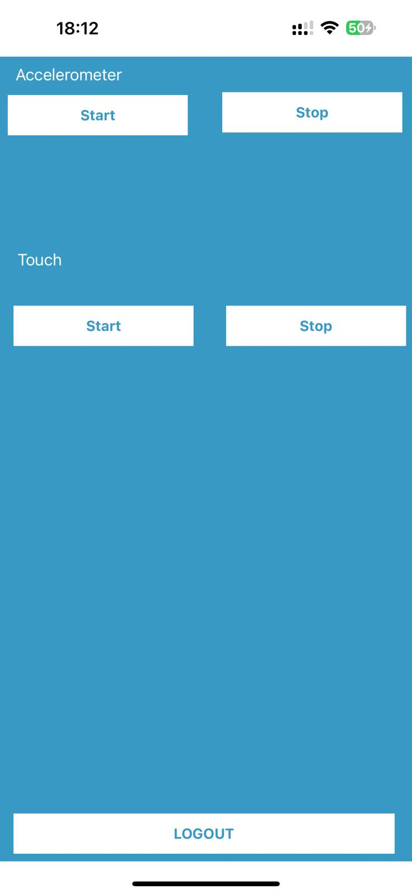
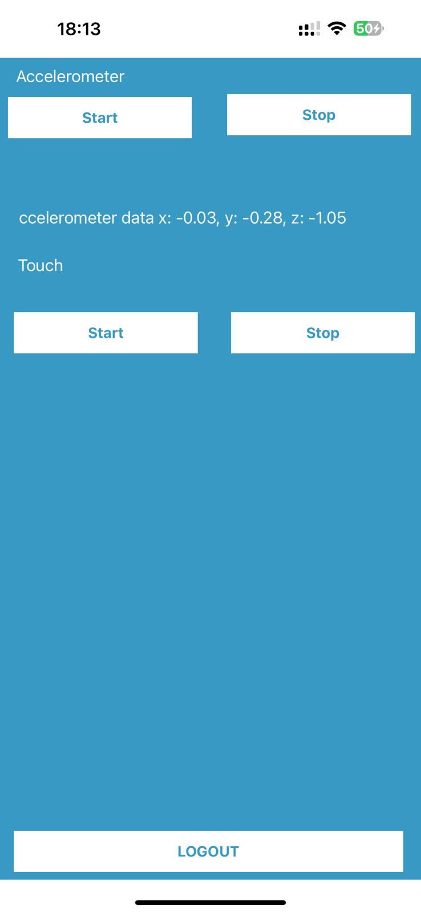
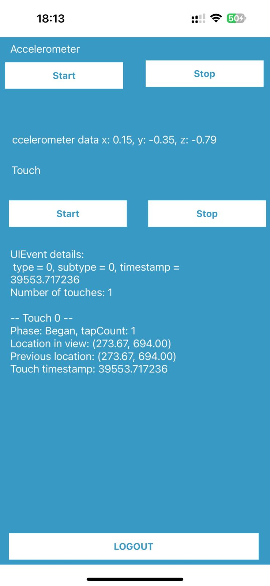
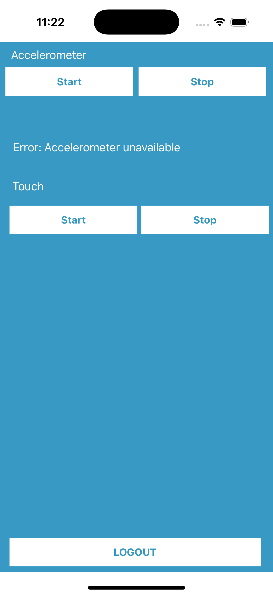

# Module AccelerometerTouchTrackerIosSdk

# Integration Guide: [AccelerometerTouchTrackerIosSdk]

## Table of Contents
1. [Introduction]
2. [Prerequisites]
3. [Setup Instructions]
    1. [Step 1: Install Dependencies]
    2. [Step 2: Configure the Integration]
    3. [Step 3: Test the Integration]
4. [Demo]
5. [Authentication]
6. [API Reference]
7. [Testing Recommendations]
8. [Areas for Enhancement]
9. [Common Errors & Troubleshooting]
10. [FAQs]
11. [Support]

---

## Introduction

This guide provides step-by-step instructions for integrating [AccelerometerTouchTrackerIosSdk] into your project.
Follow the instructions to quickly get started and connect your system with [AccelerometerTouchTrackerIosSdk].

---

## Prerequisites
Before you begin the integration process, make sure you have the following:
- Access to your [system’s] configuration settings
- In future will add A ApiKey service from [AccelerometerTouchTrackerIosSdk]

## Setup Instructions

### Step 1: Install Dependencies
Start by installing the required dependencies to your project.
Use one of the following commands based on your package manager.
Add to your Podfile:

pod 'AccelerometerTouchTrackerIosSdk', :git => 'https://github.com/adhamkhwaldeh/AccelerometerTouchTrackerIosSdk.git'

### Step 2: Configure the Integration
No additional configuration is required for the SDK, 
**We will add "AccelerometerTouchTrackerIosSdk api key" in the forthcoming releases **

### Step 3: Test the Integration

#### Use Managers with related callback interfaces
      1. **AccelerometerManager:**  
        With AccelerometerListener and  errorListener could be used in both application and controller level
      2. **TouchWindow:**  
        With onTouchesEvent to observe the touch events on application level without customize UIApplication
      3. **BaseTouchApplication and BaseTouchObjCApplication:** 
        With onTouchesEvent to observe the touch events on application level with customize UIApplication
      4. **BaseTouchTrackingViewController and BaseTouchTrackingObjectCViewController:** 
        With handleTouchEvent to observe the touch events on controller level

This allows you to customize logging, and other behaviors.
Currently I have Added a local Logger but in real project we can use services like firebase crash report.

## Demo

### Screenshots

- **Dashboard View**

|  |  |  |
     |
|-------------------------------------------------------------------------------|-------------------------------------------------------------------------------|-------------------------------------------------------------------------------|-------------------------------------------------------------------------------|

## Authorization
So far no authentication is required for the SDK. In future releases, we will add an API key service to enhance security.

## Testing Recommendations

To further improve your SDK's reliability, add more **Unit Tests** :

### Unit Tests
- Cover all public methods in managers, listeners, models, and utility classes.
- Test error handling, and configuration logic.
- Validate logger and metrics integration.

**Unit Test File:**
- `./AccelerometerTouchtrackerIosSdkTests/AccelerometerManagerTests.kt`

## Areas for Enhancement

The following areas are recommended for further enhancement to improve the SDK's robustness, flexibility, and usability:

- **Analytics Integration:** Provide hooks for integrating with analytics or crash reporting tools.
- **Add SonarQube &Unit & Instrumentation Tests** to cover all required test cases (many cases need to be covered I've added samples only),
  We need to increase test coverage, especially for edge cases and error handling.
- **Add Dependency Injection** Support DI frameworks (like Hilt or Dagger) for easier integration and testing.
- **CI/CD with github actions and fastlane** I've added a sample workflow for CI/CD using GitHub Actions, but it can be enhanced with more steps like code quality checks, automated testing, and deployment.

## Common Errors & Troubleshooting
https://github.com/adhamkhwaldeh/AccelerometerTouchTrackerIosSdk/issues

## FAQs
https://github.com/adhamkhwaldeh/AccelerometerTouchTrackerIosSdk/issues

## Support
https://github.com/adhamkhwaldeh/AccelerometerTouchTrackerIosSdk
